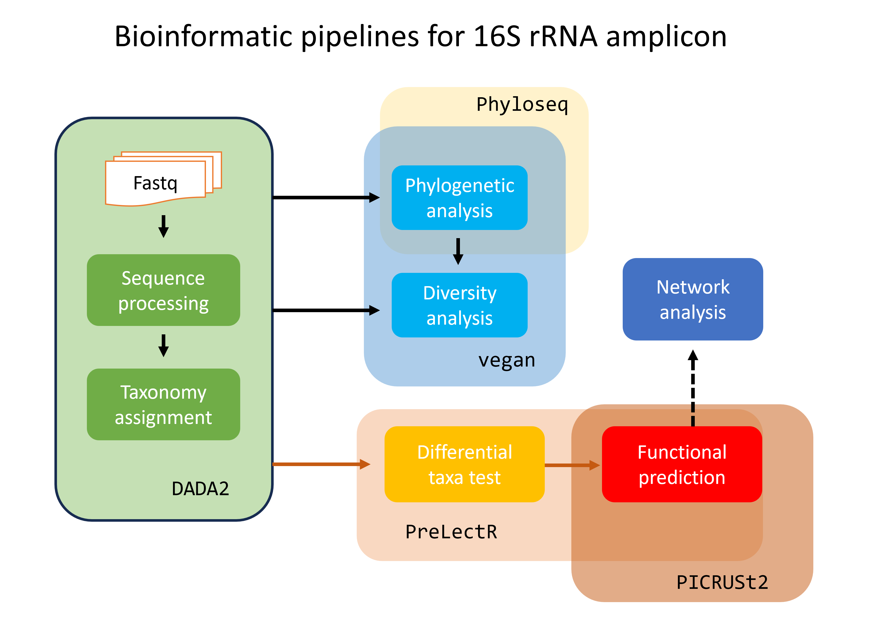
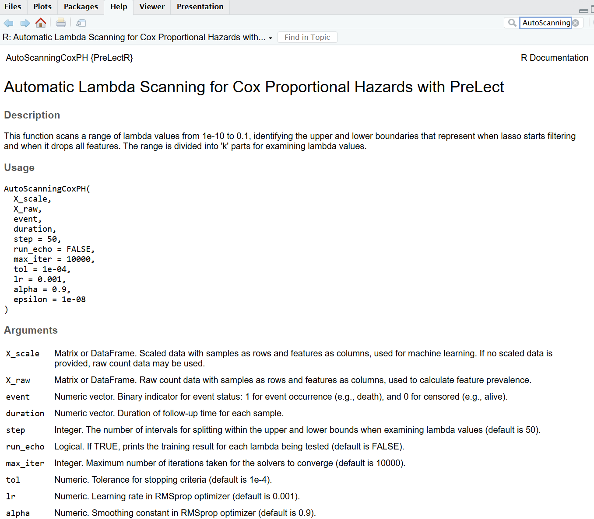

```{r setup, include=FALSE}
library(patchwork)
library(learnr)
library(shiny)
```

## Introduction

`PreLectR` is an R package implementing the PreLect algorithm for feature engineering in sparse data. It supports four tasks, the objective for four task are following function:

$$
\begin{aligned}
\text{Binary classification} : J(\mathbf{w}) = \text{BCE}(\mathbf{y}, \hat{\mathbf{y}}) + \color{red}{\lambda \sum_j \frac{|\mathbf{w}_j|}{p_j}} \\
\text{Regression} : J(\mathbf{w}) = \text{MSE}(\mathbf{y}, \hat{\mathbf{y}}) + \color{red}{\lambda \sum_j \frac{|\mathbf{w}_j|}{p_j}} \\
\text{Multi-class classification} : J(\mathbf{w}) = \frac{1}{c} \sum_{l=1}^{c} \left( \text{BCE}(\mathbf{y}_l, \hat{\mathbf{y}}_l) + \color{red}{\lambda \sum_{j=1}^{d} \frac{|\mathbf{w}_{j,l}|}{p_{j,l}}} \right) \\
\text{Time-to-event} : J(\mathbf{w}) = h_0(t) \cdot e^{\sum{x_i \cdot w}}+ \color{red}{\lambda \sum_j \frac{|\mathbf{w}_j|}{p_j}} \\
\end{aligned}
$$

PreLectR is designed for omics data with sparse characteristics, such as miRNA and scRNA. But we have tailored the workflow to be particularly suitable for amplicon data.

***

{width="70%"}

For 16S amplicon data, PreLectR provides a seamless workflow to integrate with DADA2 and includes downstream functional enrichment analysis using `PICRUSt2`, ensuring a user-friendly experience.

## Installation

`PreLectR` can be installed from GitHub using:

```{r, eval = FALSE}
install.packages("remotes")
remotes::install_github("YinchengChen23/PreLectR")
```

#### Package Dependencies

-   **For model estimation**: `Rcpp` and `RcppArmadillo`
-   **For parallel computing**: `parallel`, `doParallel`, `foreach`
-   **For graphical purposes**: `ggplot2` and `patchwork`
-   **For functional enrichment analysis (KEGG)**: `KEGGREST`

## General usage

### Automatically lambda scanning

The Lasso base method has a hyperparameter, `lambda`, which represents the regularization intensity that needs to be set.

$$
J(\mathbf{w}) = \text{BCE}(\mathbf{y}, \hat{\mathbf{y}}) + \color{red}{\lambda} \sum_j \frac{|\mathbf{w}_j|}{p_j} \\
$$

Unlike common strategies for parameter tuning (based on performance), we propose a method to determine the parameter based on the variation of the loss value. We propose determining the optimal lambda value based on the inflection point of the loss curve. This point marks the crucial balance where the regularization term outweighs the loss term.

{width="70%"}

So we design a function `AutoScanning` which can automatically scan the lambda from from $10^{-10}$ to $10^{-1}$, and identify the upper and lower boundaries representing lasso start filtering and lasso drop all features respectively (black dotted line). And divide `k` parts whitin this region as the examining lambdas.

{width="70%"}

```{r, eval = TRUE, message = FALSE, warning=FALSE, results='hide'}
library(PreLectR)
library(patchwork)
library(ggplot2)

set.seed(42)
n_samples <- 10
n_features <- 100

# create a demo raw count matrix
X_raw <- matrix(rnbinom(n_features * n_samples, size = 10, mu = 1), nrow = n_features, ncol = n_samples)
print(dim(X_raw))
## [1] 100  10

# feature-wise z-standardization
X_scaled <- t(scale(t(X_raw)))

# create a lable for each sample
diagnosis <- c('CRC','CRC','control','CRC','control','CRC','control','control','CRC','CRC')

# assign the control-sample at the first order of levels in factor function
diagnosis <- factor(diagnosis, levels = c('control', 'CRC'))

lrange <- AutoScanning(X_scaled, X_raw, diagnosis, task = "classification", step=30)
print(length(lrange))
## [1] 30
```

### Lambda tuning

Next, we examine each testing lambda by assessing feature prevalence and calculating various performance metrics using the `LambdaTuning` function with a 7/3 train-test split.

Since this procedure is time-consuming, we suggest running it with `nohup` if it takes too long. We also provide an `outpath` option to save the results to a folder of your choice."

Alternatively, if parallel computing is available on your PC, you can also use `LambdaTuningParallel` to accelerate the calculation process.

```{r, eval = TRUE, message = FALSE, warning=FALSE, results='hide'}
output_dir <- '/home/yincheng23/Course/PLdemo/try1'                     # task = "classification" OR "regression"
tuning_res <- LambdaTuning(X_scaled, X_raw, diagnosis, lrange, outpath=output_dir, spl_ratio=0.7, task="classification")
print(dir(output_dir))
## [1] "Pvl_distribution.csv" "TuningResult.csv"


# Parallel computing
# tuning_res <- LambdaTuningParallel(X_scaled, X_raw, diagnosis, lrange, n_cores=10, outpath=output_dir, spl_ratio=0.7)
```

```{r, eval = TRUE}
tuning_res$TuningResult
```

```{r, eval = TRUE}
tuning_res$PvlDistSummary
```

```{r, eval = FALSE}
# recall the tuning results
TuningResult <- read.csv(paste0(output_dir,'/TuningResult.csv'))
PvlDistSummary <- read.csv(paste0(output_dir,'/Pvl_distribution.csv'))
```

### Optimal lambda decision

Determines the optimal lambda value based on the inflection point of the loss curve, which represents the critical balance where the regularization term begins to outweigh the loss term. This function, `LambdaDecision`, finds the inflection point by segmenting the loss curve into n parts through segmented regression.

Segmented regression is implemented using `Recursive Partitioning and Regression Trees`, selecting the first breakpoint as the optimal lambda.

```{r, eval = TRUE, message = FALSE, warning=FALSE, results='hide'}
lmbd_picking <- LambdaDecision(tuning_res$TuningResult, tuning_res$PvlDistSummar, maxdepth=5, minbucket=3)

# optimal lambda
print(lmbd_picking$opt_lmbd)
## [1] 0.0004893901
```

```{r, eval = TRUE, message = FALSE, warning=FALSE}
lmbd_picking$selected_lmbd_plot/lmbd_picking$pvl_plot
```

### Feature selection

Once the optimal lambda is determined, you can use the `GetPrevalence` function to calculate the prevalence of each feature from raw count data. Then, apply the `PreLect` function to compute the final results. The `FeatureProperty` function helps to access the properties for each feature.

```{r, eval = TRUE, message=FALSE, warning=FALSE, results='hide'}
# input data need rowname as feature ids.
rownames(X_scaled) <- sprintf(paste0("ASV%0", 3, "d"), 1:nrow(X_scaled))

prevalence <- GetPrevalence(X_raw)

# prelect body
s=Sys.time()
PreLect_out <- PreLect(X_scaled, prevalence, diagnosis, lambda=lmbd_picking$opt_lmbd, task="classification")
print(Sys.time()-s)
## Time difference of 0.02779007 secs

featpropt <- FeatureProperty(X_raw, diagnosis, PreLect_out, task="classification")

print(paste(nrow(featpropt[featpropt$selected == 'Selected', ]), 'features were selected'))
## [1] "18 features were selected"

print(paste('median of prevalence :', median(featpropt$prevalence[featpropt$selected == 'Selected'])))
## [1] "median of prevalence : 0.8"
```

```{r, eval = TRUE}
featpropt
```

### Selection profile visualization

We can use the featprop table to easily examine the characteristics of the selected features.

```{r, eval = TRUE}
ggplot(featpropt, aes(x = prevalence, y = meanAbundance, color=selected)) + geom_point() +
  scale_color_manual(values = c('Selected'='red', 'Others'='#AAAAAA')) +
  theme_bw()+ theme(panel.background = element_rect(fill = "white", colour = "white"))
```

```{r, eval = TRUE}
ggplot(featpropt, aes(x = prevalence, y = variance, color=selected)) + geom_point() +
  scale_color_manual(values = c('Selected'='red', 'Others'='#AAAAAA')) +
  coord_trans(y = "log10") +
  theme_bw()+ theme(panel.background = element_rect(fill = "white", colour = "white"))
```

```{r, eval = TRUE}
ggplot(featpropt, aes(x = prevalence_control, y = prevalence_case, color=selected)) + geom_point() +
  scale_color_manual(values = c('Selected'='red', 'Others'='#AAAAAA')) +
  theme_bw()+ theme(panel.background = element_rect(fill = "white", colour = "white"))
```

## Special tasks

Function usage in different tasks :

| Task   | Binary classification | Regression | Multi-class classification | Time-to-event |
|--------|----------|----------|----------|----------|
| Step 1 | AutoScanning| AutoScanning   | AutoScanningMultiClass | AutoScanningCoxPH |
| Step 2 | LambdaTuning | LambdaTuning | LambdaTuningMultiClass | LambdaTuningCoxPH | 
| Step 2 (optional) | LambdaTuningParallel  | LambdaTuningParallel | LambdaTuningMultiClassParallel | LambdaTuningCoxPHParallel | 
| Step 3 | LambdaDecision  | LambdaDecision | LambdaDecision | LambdaDecision |
| Step 4 | PreLect | PreLect | PreLectMultiClass | PreLectCoxPH |
| Step 5 | FeatureProperty | FeatureProperty | FeatureProperty | FeatureProperty |
| Step 5 | TaxaProperty | TaxaProperty | Nan | TaxaProperty |
| Step 6 | GSEATestwithFC | GSEATest | Nan | GSEATestwithFC or GSEATest |

***

{width="70%"}


## Real world data demonstration

```{r, include=FALSE}
rm(list=ls())
```

We subsetted a CRC study dataset from Zeller et al. 2014, including 20 patients each from the normal and cancer groups, and used the DADA2 pipeline to complete the analysis up to the taxonomic assignment step.

```{r, eval = TRUE, warning=FALSE}
dataset_path <- system.file("data", "Zeller_CRC.RData", package = "PreLectR")
if (file.exists(dataset_path)) {
  load(dataset_path)
} else {
  stop("Zeller_CRC.RData not found!")
}
print(ls())
```

Check patients condition.
```{r, eval = TRUE, message=FALSE, warning=FALSE}
print(table(meta$Class))
print(table(meta$diagnosis))
```

Prepare the information for time-to-event testing.
```{r, eval = TRUE}
meta$event <- ifelse(meta$Class == 'Cancer', 1, 0)
meta$duration <- meta$age
```

We designed the `DADA2Adapter` function to bridge the data into the `PreLect` pipeline.
```{r, eval = TRUE, warning=FALSE}
# set the working  directory 
output_path <- '/home/yincheng23/Course/PLdemo/try2'

# generate the raw count table, taxa table and ASV sequence fasta
DADA2Adapter(seqtab.nochim, taxa, output_path)
dir(output_path)
```

```{r, eval = TRUE, message=FALSE, warning=FALSE, results='hide'}
# load the data we need
data <- read.csv(paste0(output_path,'/ASV_table.txt'), sep = '\t')
taxa <- read.csv(paste0(output_path,'/ASV_taxa_table.txt'), sep = '\t')

# Variance Stabilization Transformation
library(DESeq2)
data_pseudo_count <- data + 1
meta$Class <- factor(meta$Class)

dds <- DESeqDataSetFromMatrix(countData = data_pseudo_count,
                              colData = meta,
                              ~ Class)

vst <- varianceStabilizingTransformation(dds, fitType="mean", blind= T)

vst_table <- assay(vst)

# feature-wise z-standardization
data_scaled <- t(scale(t(as.matrix(vst_table))))
```

***

### Automatically lambda scanning and lambda yuning 

Automatically perform lambda scanning to identify 30 lambda values for examination.
```{r, eval = TRUE, message=FALSE, warning=FALSE}
meta$Class <- factor(meta$Class, levels = c("Normal", "Cancer"))
lrange <- AutoScanning(data_scaled, data, meta$Class, step =30)
length(lrange)
exp(lrange)
```


Examining the testing lambda.
```{r, eval = TRUE, message=FALSE, warning=FALSE}
tuning_res <- LambdaTuningParallel(data_scaled, data, meta$Class, lrange, n_cores=10, outpath='~/ADlasso_manuscript/R_pkg/test')
```

```{r, eval = TRUE}
tuning_res$TuningResult
```

```{r, eval = TRUE}
tuning_res$PvlDistSummary
```

***

### Optimal lambda decision and feature selection
 
Determine the optimal lambda by partitioning tree.
```{r loading, include=FALSE}
data_scaled <- readRDS(file = system.file("data", "crc_data_scaled.rds", package = "PreLectR"))
data <- readRDS(file = system.file("data", "crc_data.rds", package = "PreLectR"))
taxa <- readRDS(file = system.file("data", "crc_taxa.rds", package = "PreLectR"))
meta <- readRDS(file = system.file("data", "crc_meta.rds", package = "PreLectR"))
tuning_res <- readRDS(file = system.file("data", "crc_tuning_res.rds", package = "PreLectR"))
featpropt <- readRDS(file = system.file("data", "crc_featpropt.rds", package = "PreLectR"))

GSEAresult <- readRDS(file = system.file("data", "crc_GSEAresult.rds", package = "PreLectR"))
KOinfo <- readRDS(file = system.file("data", "crc_KOinfo.rds", package = "PreLectR"))
```

```{r lambda_picking, exercise = TRUE, exercise.eval = FALSE, exercise.setup = "loading"}
lmbd_picking <- LambdaDecision(tuning_res$TuningResult, tuning_res$PvlDistSummary, maxdepth=5, minbucket=3)

lmbd_picking$selected_lmbd_plot/lmbd_picking$pvl_plot

print(lmbd_picking$opt_lmbd)
```

PreLect execution and get the property for each feature
```{r prelect_run, exercise = TRUE, exercise.eval = FALSE, exercise.setup = "lambda_picking"}
prevalence <- GetPrevalence(data)

s=Sys.time()
PreLect_out <- PreLect(data_scaled, prevalence, meta$Class, lambda=lmbd_picking$opt_lmbd)
print(Sys.time()-s)


featpropt <- FeatureProperty(data, meta$Class, PreLect_out, task="classification")

print(paste(nrow(featpropt[featpropt$selected == 'Selected', ]), 'features were selected'))

print(paste('median of prevalence :', median(featpropt$prevalence[featpropt$selected == 'Selected'])))


featpropt
```

***

### Selection profile visualization and evaluation

```{r feat_visualization, exercise = TRUE, exercise.eval = FALSE, exercise.setup = "loading"}
library(scales)
ggplot(featpropt, aes(x = prevalence, y = meanAbundance, color=selected)) + geom_point() +
  scale_color_manual(values = c('Selected'='red', 'Others'='#AAAAAA')) + 
  scale_y_log10(breaks = trans_breaks("log10", function(x) 10^x),
                labels = trans_format("log10", math_format(10^.x))) +
  theme_bw()+ theme(panel.background = element_rect(fill = "white", colour = "white"))
```

```{r feat_evaluation, exercise = TRUE, exercise.eval = FALSE, exercise.setup = "loading"}
y <- ifelse(meta$Class == "Cancer", 1, 0) 

split   <- TrainTextSplit(y)
X_train <- data_scaled[, split$train_idx]
X_test  <- data_scaled[, split$test_idx]
y_train <- y[split$train_idx]
y_test  <- y[split$test_idx]

perf <- evaluation(X_train, y_train, X_test, y_test, featpropt$coef, task='classification')
perf
```

```{r taxa_visualization, exercise = TRUE, exercise.eval = FALSE, exercise.setup = "loading"}
result <- TaxaProperty(featpropt, taxa, "Family",  pvl_filter = 0.5)

mycolor <- c("Normal" = "#FFCC22", "Cancer" = "#EE7700")
result$effectSizePlot + scale_fill_manual(values = mycolor) +
   geom_hline(yintercept = 0, color='black', linetype='dashed')


head(result$selectedInfo)

```

***

### Functional prediction analysis

Prepare files for running PICRUSt2 by extracting the selected ASVs.
``````{r, eval = FALSE}
# please ensure the "ASV.fasta" is in "output_path" directory
print(output_path)
selected_id <- featpropt$FeatName[featpropt$selected == 'Selected']
data_sub <- data[selected_id, ]
data_sub <- rbind(colnames(data_sub), data_sub)
colnames(data_sub) <- NULL
rownames(data_sub)[1] <- "#OTU ID"
write.table(data_sub, paste0(output_path,"/for_PICRUSt2.tsv"), sep = "\t", quote=F, col.names	=F)
```

{width="70%"}

Conduct the PICRUSt2 pipeline via docker
``````{bash, eval = FALSE}
# Bash
# run the PICRUSt2 pipeline

# ensure the "ASV.fasta" and "for_PICRUSt2.tsv" files are in the same directory 
# and set the working directory to that location before running this script.
cd /home/yincheng23/Course/PLdemo/try2
docker run \
    -it \                          # interactive terminal mode, allowing you to interact with the container.
    --rm \                         # automatically remove the container after it exits to save disk space.
    -v $(pwd):/tmp \               # bind mount the current directory ($(pwd)) to /tmp in the container.
    yincheng23/picrust2:0.2.0 \    # specify the Docker image to use; it will be pulled from Docker Hub if not available locally.
    sh /bin/Run_picrust2.sh 10     # use the shell to execute the built-in script (Run_picrust2.sh) with 10 cores for parallel processing.
    
# the results will store as /home/yincheng23/Course/PLdemo/try2/PICRUSt2
    
```

{width="70%"}

Conduct the GSEA with permutation test via `GSEATestwithFC` or `GSEATest`
```{r, eval = FALSE}
# load the KO-taxa relationship file
# uncomment the following line if using a local file path:
# KOindex <- read.table(paste0(output_path,"/PICRUSt2/KO/pred_metagenome_contrib.tsv"), sep = "\t", header = TRUE)
KOindex <- readRDS(file = system.file("data", "crc_KOindex.rds", package = "PreLectR"))

# extract the selected ASV identifiers
selected_id <- featpropt$FeatName[featpropt$selected == 'Selected']

# Provide the raw count table for logFC calculation, subsetting with the selected ASVs.
# Additionally, specify the labels for each sample and the name of the case sample group.
GSEAresult <- GSEATestwithFC(KOindex, data[selected_id, ], meta$Class, "Cancer")

## Building the KO-to-taxa mapper...
## Done. In total, 5755 KOs need to be processed.
## Shuffling the labels for GSEA...
## Performing GSEA to identify activated KOs...
##   |============================================================================================================| 100%
## Shuffling the labels for GSEA...
## Performing GSEA to identify suppressed KOs...
##   |============================================================================================================| 100%
## Done.


# If the grouping variable is continuous (e.g., body mass index), use the following line instead:
# GSEAresult <- GSEATest(KOindex, data[selected_id, ], meta$body.mass.index)
```


```{r GSEA_result_veiw, exercise = TRUE, exercise.eval = FALSE, exercise.setup = "loading"}
Actived_result <- GSEAresult$Actived_KO
Actived_result <- Actived_result[!is.na(Actived_result$z), ]
Actived_result <- Actived_result[Actived_result$z > 2,]
Actived_result <- Actived_result[Actived_result$p < 0.05,]
nrow(Actived_result)
```

***

We provide the `GetKOInfo` function for retrieving KO information using the KEGG API. But this is very time-consuming, querying 6000 KOs takes about 1 hour
```{r, eval = FALSE}
Descrip <- read.table(paste0(output_path,'/PICRUSt2/KO/pred_metagenome_unstrat_descrip.tsv', as.is = TRUE, stringsAsFactors = F, sep = '\t', header = T)
query_KOs <- unique(Descrip$function.)
KOinfo <- GetKOInfo(query_KOs)
```

```{r check_ko_infor, exercise = TRUE, exercise.eval = FALSE, exercise.setup = "loading"}
KOinfo
```

Examining the condition enriched pathway with Fisher's exact test via `PathwayEnrichment`
```{r pw, exercise = TRUE, exercise.eval = FALSE, exercise.setup = "loading"}
Actived_result <- GSEAresult$Actived_KO
Actived_result <- Actived_result[!is.na(Actived_result$z), ]
Actived_result <- Actived_result[Actived_result$z > 2,]
Actived_result <- Actived_result[Actived_result$p < 0.05,]
selected_KOs <- Actived_result$KO

enrichPW <- PathwayEnrichment(selected_KOs, KOinfo)
enrichPW$q <- p.adjust(enrichPW$p, method = 'fdr')
enrichPW <- enrichPW[enrichPW$q < 0.05, ]
nrow(enrichPW)
```


```{r pw_plot, exercise = TRUE, exercise.eval = FALSE, exercise.setup = "loading"}
Actived_result <- GSEAresult$Actived_KO
Actived_result <- Actived_result[!is.na(Actived_result$z), ]
Actived_result <- Actived_result[Actived_result$z > 2,]
Actived_result <- Actived_result[Actived_result$p < 0.05,]
selected_KOs <- Actived_result$KO

enrichPW <- PathwayEnrichment(selected_KOs, KOinfo)
enrichPW$q <- p.adjust(enrichPW$p, method = 'fdr')
enrichPW <- enrichPW[enrichPW$q < 0.05, ]

enrichPW$pathway <- factor(enrichPW$pathway, levels = enrichPW$pathway[order(enrichPW$count)])
ggplot(enrichPW, aes(x = pathway, y = count, fill = q)) + ggtitle('Enhanced in colorectal cancer') +
  geom_bar(stat="identity",colour = "black",size = 0.1) +  coord_flip() + labs(y = 'KO Hits', fill = "q-value") +
  scale_fill_continuous(low = "red", high = "blue", limits = range(enrichPW$q)) +
  theme(axis.text.y = element_text(color='black', size='10'),
        axis.line = element_line(linetype = 1,colour = 'black'),
        axis.title.y = element_blank(),
        panel.background = element_rect(I(0)),
        panel.grid.major = element_line(colour = NA),
        panel.grid.minor = element_line(colour = NA)) + coord_flip()


```
