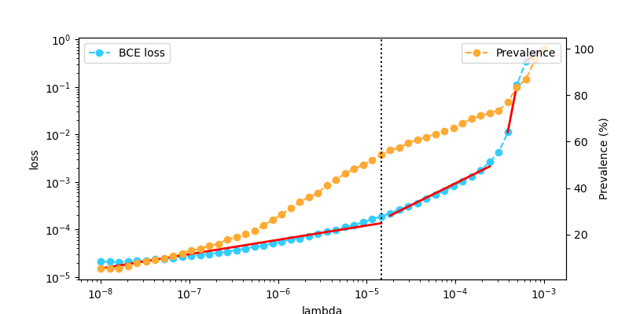
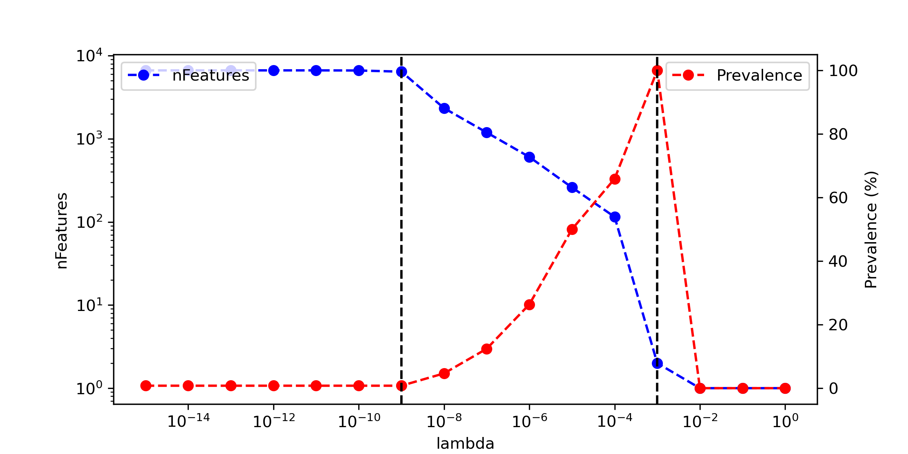
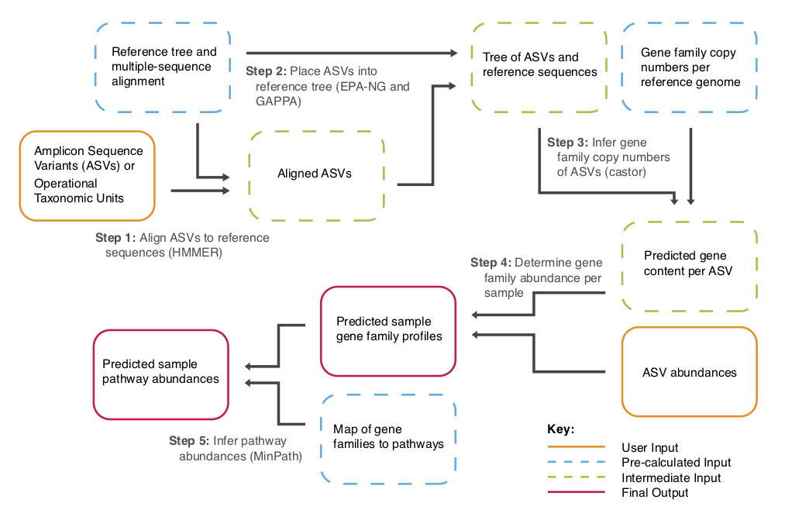

```{r setup, include=FALSE}
knitr::opts_chunk$set(comment = "", echo = TRUE)
```


`PreLectR` is an R package implementing the PreLect algorithm for feature engineering in sparse data. It supports four tasks: binary classification, multi-class classification, regression, and time-to-event analysis. The package leverages `RcppArmadillo` and `parallel` for enhanced performance. For 16S amplicon data, PreLectR provides a seamless workflow to integrate with DADA2 and includes downstream functional enrichment analysis using `PICRUSt2`, ensuring a user-friendly experience.


Table of Contents
====================
- [Installation](#in)
- [General usage](#gu)
- [Special tasks](#st)
- [Tutorial for amplicon data](#ta)
- [License](#li)
- [Citing Resources](#cr)
- [Found a Bug](#fb)

***

<span id="in"> </span>

## Installation {#in}

`PreLectR` can be installed from GitHub using:

```{r, eval = FALSE}
install.packages("remotes")
remotes::install_github("YinchengChen23/PreLectR")
```

#### Package Dependencies

-   **For model estimation**: `Rcpp` and `RcppArmadillo`
-   **For parallel computing**: `parallel`, `doParallel`, `foreach`
-   **For graphical purposes**: `ggplot2` and `patchwork`

Due to the use of `RcppArmadillo` and `Rcpp` for compilation, window users may fail to install.

***

<span id="gu"> </span>

## General usage

#### Automatically Lambda Scanning

The Lasso base method has a hyperparameter, `lambda`, which represents the regularization intensity that needs to be set.


$J(\mathbf{w}) = \text{BCE}(\mathbf{y}, \hat{\mathbf{y}}) + \color{red}{\lambda} \sum_j \frac{|\mathbf{w}_j|}{p_j}$


Unlike common strategies for parameter tuning (based on performance), we propose a method to determine the parameter based on the variation of the loss value. We propose determining the optimal lambda value based on the inflection point of the loss curve. This point marks the crucial balance where the regularization term outweighs the loss term.

{width="70%"}

So we design a function `AutoScanning` which can automatically scan the lambda from from $10^{-10}$ to $10^{-1}$, and identify the upper and lower boundaries representing lasso start filtering and lasso drop all features respectively (black dotted line). And divide `k` parts whitin this region as the examining lambdas.

{width="70%"}

```{r, eval = TRUE, message=FALSE, warning=FALSE, collapse=TRUE}
library(PreLectR)
library(patchwork)
library(ggplot2)

set.seed(42)
n_samples <- 10
n_features <- 100
 
X_raw <- matrix(rnbinom(n_features * n_samples, size = 10, mu = 1), nrow = n_features, ncol = n_samples)
print(dim(X_raw))

# feature-wise z-standardization
X_scaled <- t(scale(t(X_raw)))
diagnosis <- c('CRC','CRC','control','CRC','control','CRC','control','control','CRC','CRC')

# assign the control-sample at the first order of levels in factor function
diagnosis <- factor(diagnosis, levels = c('control', 'CRC'))

                                         # task = "classification" OR "regression"
lrange <- AutoScanning(X_scaled, X_raw, diagnosis, task = "classification", step=30)

print(exp(lrange))
```

### Lambda Tuning for Feature Selection

Next, we examine each testing lambda by assessing feature prevalence and calculating various performance metrics using the `LambdaTuning` function with a 7/3 train-test split.

Since this procedure is time-consuming, we suggest running it with `nohup` if it takes too long. We also provide an `outpath` option to save the results to a folder of your choice."

Alternatively, if parallel computing is available on your PC, you can also use `LambdaTuningParallel` to accelerate the calculation process.


```{r, eval = TRUE, message=FALSE, warning=FALSE, collapse=TRUE}
output_dir <- '/home/yincheng23/Course/PLdemo/try1'                # task = "classification" OR "regression"
tuning_res <- LambdaTuning(X_scaled, X_raw, diagnosis, lrange, outpath=output_dir, spl_ratio=0.7, task="classification")


print(dir(output_dir))

# Parallel computing
# tuning_res <- LambdaTuningParallel(X_scaled, X_raw, diagnosis, lrange, n_cores=10, outpath=output_dir, spl_ratio=0.7)
```

```{r, eval = TRUE}
head(tuning_res$TuningResult)
```

```{r, eval = TRUE}
head(tuning_res$PvlDistSummary)
```

If you run the tuning process from the command line, you can retrieve the results using `read.csv`.

```{r, eval = FALSE, message=FALSE, warning=FALSE}
# recall the tuning result
TuningResult <- read.csv(paste0(output_dir,'/TuningResult.csv'))
PvlDistSummary <- read.csv(paste0(output_dir,'/Pvl_distribution.csv'))
```

### Optimal Lambda Decision

Determines the optimal lambda value based on the inflection point of the loss curve, which represents the critical balance where the regularization term begins to outweigh the loss term. This function, `LambdaDecision`, finds the inflection point by segmenting the loss curve into n parts through segmented regression.

Segmented regression is implemented using `Recursive Partitioning and Regression Trees`, selecting the first breakpoint as the optimal lambda.

```{r, eval = TRUE, message=FALSE, warning=FALSE, collapse=TRUE}
# recall the tuning result
lmbd_picking <- LambdaDecision(tuning_res$TuningResult, tuning_res$PvlDistSummar, maxdepth=5, minbucket=3)

# optimal lambda
print(lmbd_picking$opt_lmbd)

lmbd_picking$selected_lmbd_plot/lmbd_picking$pvl_plot
```

### Feature selection

```{r, eval = TRUE, message=FALSE, warning=FALSE, collapse=TRUE}
rownames(X_scaled) <- sprintf(paste0("ASV%0", 3, "d"), 1:nrow(X_scaled))

prevalence <- GetPrevalence(X_raw)

s=Sys.time()
PreLect_out <- PreLect(X_scaled, prevalence, diagnosis, lambda=lmbd_picking$opt_lmbd, task="classification")
print(Sys.time()-s)


featpropt <- FeatureProperty(X_raw, diagnosis, PreLect_out, task="classification")

print(paste(nrow(featpropt[featpropt$selected == 'Selected', ]), 'features were selected'))

print(paste('median of prevalence :', median(featpropt$prevalence[featpropt$selected == 'Selected'])))


head(featpropt)
```

### Selection profile visualization

```{r, eval = TRUE}
ggplot(featpropt, aes(x = prevalence, y = meanAbundance, color=selected)) + geom_point() +
  scale_color_manual(values = c('Selected'='red', 'Others'='#AAAAAA')) +
  theme_bw()+ theme(panel.background = element_rect(fill = "white", colour = "white"))
```

```{r, eval = TRUE}
ggplot(featpropt, aes(x = prevalence, y = variance, color=selected)) + geom_point() +
  scale_color_manual(values = c('Selected'='red', 'Others'='#AAAAAA')) +
  coord_trans(y = "log10") +
  theme_bw()+ theme(panel.background = element_rect(fill = "white", colour = "white"))
```

```{r, eval = TRUE}
ggplot(featpropt, aes(x = prevalence_control, y = prevalence_case, color=selected)) + geom_point() +
  scale_color_manual(values = c('Selected'='red', 'Others'='#AAAAAA')) +
  theme_bw()+ theme(panel.background = element_rect(fill = "white", colour = "white"))
```

***

<span id="st"> </span>

## Special tasks

`PreLectR` is an R package implementing the PreLect algorithm for feature engineering in sparse data. It supports four tasks, the objective for four task are following function:


$\text{Binary classification} : J(\mathbf{w}) = \text{BCE}(\mathbf{y}, \hat{\mathbf{y}}) + \color{red}{\lambda \sum_j \frac{|\mathbf{w}_j|}{p_j}}$


$\text{Regression} : J(\mathbf{w}) = \text{MSE}(\mathbf{y}, \hat{\mathbf{y}}) + \color{red}{\lambda \sum_j \frac{|\mathbf{w}_j|}{p_j}}$


$\text{Multi-class classification} : J(\mathbf{w}) = \frac{1}{c} \sum_{l=1}^{c} \left( \text{BCE}(\mathbf{y}_l, \hat{\mathbf{y}}_l) + \color{red}{\lambda \sum_{j=1}^{d}\frac{|\mathbf{w}_{j,l}|}{p_{j,l}}} \right)$


$\text{Time-to-event} : J(\mathbf{w}) = h_0(t) \cdot e^{\sum{x_i \cdot w}}+ \color{red}{\lambda \sum_j \frac{|\mathbf{w}_j|}{p_j}}$

Function usage in different tasks :

| Task   | Binary classification | Regression | Multi-class classification | Time-to-event |
|--------|----------|----------|----------|----------|
| Step 1 | AutoScanning| AutoScanning   | AutoScanningMultiClass | AutoScanningCoxPH |
| Step 2 | LambdaTuning | LambdaTuning | LambdaTuningMultiClass | LambdaTuningCoxPH | 
| Step 2 (optional) | LambdaTuningParallel  | LambdaTuningParallel | LambdaTuningMultiClassParallel | LambdaTuningCoxPHParallel | 
| Step 3 | LambdaDecision  | LambdaDecision | LambdaDecision | LambdaDecision |
| Step 4 | PreLect | PreLect | PreLectMultiClass | PreLectCoxPH |
| Step 5 | FeatureProperty | FeatureProperty | FeatureProperty | FeatureProperty |
| Step 6 | TaxaProperty | TaxaProperty | Nan | TaxaProperty |
| Step 7 | GSEATestwithFC | GSEATest | Nan | GSEATestwithFC or GSEATest |

Please use help for detailed instructions on how to specify arguments, sure like `?AutoScanningCoxPH`

<span id="ta"> </span>

## Tutorial for amplicon data

Please ensure the following package are installed : `DESeq2`, `patchwork`, `PreLectR`.

```{r, include=FALSE}
rm(list=ls())
```

We subsetted a CRC study dataset from Zeller et al. 2014, including 20 patients each from the normal and cancer groups, and used the DADA2 pipeline to complete the analysis up to the taxonomic assignment step.

```{r, eval = TRUE, warning=FALSE, collapse=TRUE}
library(PreLectR)
library(patchwork)
library(ggplot2)

dataset_path <- system.file("exdata", "Zeller_CRC.RData", package = "PreLectR")
if (file.exists(dataset_path)) {
  load(dataset_path)
} else {
  stop("Zeller_CRC.RData not found!")
}
print(ls())

# Check patients condition
print(table(meta$Class))
print(table(meta$diagnosis))   # for multi-class classification

# The clinical factor for time-to-event testing
meta$event <- ifelse(meta$Class == 'Cancer', 1, 0)  # as events
meta$duration <- meta$age                           # as duration
```
        
We designed the `DADA2Adapter` function to bridge the data into the `PreLect` pipeline.

```{r, eval = TRUE, warning=FALSE, collapse=TRUE}
# set the working  directory 
output_path <- '/home/yincheng23/Course/PLdemo/try2'

# generate the raw count table, taxa table and ASV sequence fasta
DADA2Adapter(seqtab.nochim, taxa, output_path)
dir(output_path)
```

Based on [previous studies](https://www.nature.com/articles/s41467-021-23821-6), we recommend using variance-stabilizing transformation (VST) for data normalization.

```{r, eval = TRUE, message=FALSE, warning=FALSE, results='hide', collapse=TRUE}
# load the data we need
data <- read.csv(paste0(output_path,'/ASV_table.txt'), sep = '\t')
taxa <- read.csv(paste0(output_path,'/ASV_taxa_table.txt'), sep = '\t')

# Variance Stabilization Transformation
library(DESeq2)
data_pseudo_count <- data + 1
meta$Class <- factor(meta$Class)

dds <- DESeqDataSetFromMatrix(countData = data_pseudo_count,
                              colData = meta,
                              ~ Class)

vst <- varianceStabilizingTransformation(dds, fitType="mean", blind= T)

vst_table <- assay(vst)

# feature-wise z-standardization
data_scaled <- t(scale(t(as.matrix(vst_table))))

```

We will only use z-standardized table `data_scaled` and raw count table `data` for the subsequent analyses.

### Automatically lambda scanning and lambda yuning 

Automatically perform lambda scanning to identify 30 lambda values for examination.

```{r, eval = TRUE, message=FALSE, warning=FALSE, collapse=TRUE}
meta$Class <- factor(meta$Class, levels = c("Normal", "Cancer"))  # assign "Normal" as control sample
lrange <- AutoScanning(data_scaled, data, meta$Class, step =30)
length(lrange)
exp(lrange)
```

Examining the testing lambda.

```{r, eval = TRUE, message=FALSE, warning=FALSE, collapse=TRUE}
tuning_res <- LambdaTuningParallel(data_scaled, data, meta$Class, lrange, n_cores=10, outpath=output_path)
```

```{r, eval = TRUE}
head(tuning_res$TuningResult)
```

```{r, eval = TRUE}
head(tuning_res$PvlDistSummary)
```

### Optimal lambda decision and feature selection

Determine the optimal lambda by partitioning tree.

```{r, eval = TRUE, message=FALSE, warning=FALSE, collapse=TRUE}
lmbd_picking <- LambdaDecision(tuning_res$TuningResult, tuning_res$PvlDistSummary, maxdepth=5, minbucket=3)

lmbd_picking$selected_lmbd_plot/lmbd_picking$pvl_plot

print(lmbd_picking$opt_lmbd)
```

PreLect execution and get the property for each feature

```{r, eval = TRUE, message=FALSE, warning=FALSE, collapse=TRUE}
# We strongly suggest using 100000 for max_iter to achieve more accurate results.

s=Sys.time()
prevalence <- GetPrevalence(data)
PreLect_out <- PreLect(data_scaled, prevalence, meta$Class, lambda=lmbd_picking$opt_lmbd, max_iter = 100000)
print(Sys.time()-s)


featpropt <- FeatureProperty(data, meta$Class, PreLect_out, task="classification")

print(paste(nrow(featpropt[featpropt$selected == 'Selected', ]), 'features were selected'))

print(paste('median of prevalence :', median(featpropt$prevalence[featpropt$selected == 'Selected'])))

head(featpropt)
```

### Selection profile visualization and evaluation

```{r, eval = TRUE, message=FALSE, warning=FALSE, collapse=TRUE}
library(scales)
ggplot(featpropt, aes(x = prevalence, y = meanAbundance, color=selected)) + geom_point() +
  scale_color_manual(values = c('Selected'='red', 'Others'='#AAAAAA')) + 
  scale_y_log10(breaks = trans_breaks("log10", function(x) 10^x),
                labels = trans_format("log10", math_format(10^.x))) +
  theme_bw()+ theme(panel.background = element_rect(fill = "white", colour = "white"))
```

```{r, eval = TRUE, message=FALSE, warning=FALSE, collapse=TRUE}
y <- ifelse(meta$Class == "Cancer", 1, 0) 

split   <- TrainTextSplit(y)
X_train <- data_scaled[, split$train_idx]
X_test  <- data_scaled[, split$test_idx]
y_train <- y[split$train_idx]
y_test  <- y[split$test_idx]

perf <- evaluation(X_train, y_train, X_test, y_test, featpropt$coef, task='classification')
perf
```

```{r, eval = TRUE, message=FALSE, warning=FALSE, collapse=TRUE}
result <- TaxaProperty(featpropt, taxa, "Family",  pvl_filter = 0.5)

mycolor <- c("Normal" = "#FFCC22", "Cancer" = "#EE7700")
result$effectSizePlot + scale_fill_manual(values = mycolor) +
   geom_hline(yintercept = 0, color='black', linetype='dashed')


head(result$selectedInfo)

```

### Functional prediction analysis

Prepare files for running [PICRUSt2](https://huttenhower.sph.harvard.edu/picrust/) by extracting the selected ASVs.

```{r, eval = TRUE, message=FALSE, warning=FALSE, collapse=TRUE}
# please ensure the "ASV.fasta" is in "output_path" directory
print(output_path)
selected_id <- featpropt$FeatName[featpropt$selected == 'Selected']
data_sub <- data[selected_id, ]
data_sub <- rbind(colnames(data_sub), data_sub)
colnames(data_sub) <- NULL
rownames(data_sub)[1] <- "#OTU ID"
write.table(data_sub, paste0(output_path,"/for_PICRUSt2.tsv"), sep = "\t", quote=F, col.names	=F)
```

{width="70%"}

Conduct the PICRUSt2 pipeline via docker

``````{bash, eval = FALSE}
# Bash
# run the PICRUSt2 pipeline

# ensure the "ASV.fasta" and "for_PICRUSt2.tsv" files are in the same directory 
# and set the working directory to that location before running this script.
cd /home/yincheng23/Course/PLdemo/try2
docker run \
    -it \                          # interactive terminal mode, allowing you to interact with the container.
    --rm \                         # automatically remove the container after it exits to save disk space.
    -v $(pwd):/tmp \               # bind mount the current directory ($(pwd)) to /tmp in the container.
    yincheng23/picrust2:0.2.0 \    # specify the Docker image to use; it will be pulled from Docker Hub if not available locally.
    sh /bin/Run_picrust2.sh 10     # use the shell to execute the built-in script (Run_picrust2.sh) with 10 cores for parallel processing.
    
# the results will store as /home/yincheng23/Course/PLdemo/try2/PICRUSt2
    
```

Since `PICRUSt2` predicts gene abundance based on taxa abundance, differential expression analysis using this approach may be less convincing. Therefore, we adopted a `GSEA` strategy, ranking taxa by fold change based on their abundance. Using insights provided by `PICRUSt2`, we examined which species carry specific genes to assess the KOs that are actively expressed or suppressed.

{width="70%"}


Conduct the GSEA with permutation test via `GSEATestwithFC` or `GSEATest`
```{r, eval = TRUE, message=FALSE, warning=FALSE, results='hide'}
# load the KO-taxa relationship file
# output_path is the directory you save the for_PICRUSt2.tsv file
KOindex <- read.table(paste0(output_path,"/PICRUSt2/KO/pred_metagenome_contrib.tsv"), sep = "\t", header = TRUE)

# extract the selected ASV identifiers
selected_id <- featpropt$FeatName[featpropt$selected == 'Selected']

# Provide the raw count table for logFC calculation, subsetting with the selected ASVs.
# Additionally, specify the labels for each sample and the name of the case sample group.
GSEAresult <- GSEATestwithFC(KOindex, data[selected_id, ], meta$Class, "Cancer")

## Building the KO-to-taxa mapper...
## Done. In total, 5755 KOs need to be processed.
## Shuffling the labels for GSEA...
## Performing GSEA to identify activated KOs...
##   |============================================================================================================| 100%
## Shuffling the labels for GSEA...
## Performing GSEA to identify suppressed KOs...
##   |============================================================================================================| 100%
## Done.


# If the grouping variable is continuous (e.g., body mass index), use the following line instead:
# GSEAresult <- GSEATest(KOindex, data[selected_id, ], meta$body.mass.index)
```

Selected the enriched KOs with z-score

```{r, eval = TRUE, message=FALSE, warning=FALSE, collapse=TRUE}
Actived_result <- GSEAresult$Actived_KO
Actived_result <- Actived_result[!is.na(Actived_result$z), ]
Actived_result <- Actived_result[Actived_result$z > 2,]
Actived_result <- Actived_result[Actived_result$p < 0.05,]
nrow(Actived_result)
head(Actived_result)
```

Since `PICRUSt2` does not provide detailed information for each KO, we preprocess the KO-pathway table using the KEGG API.

```{r, eval = TRUE, message=FALSE, warning=FALSE, collapse=TRUE}
kodb_path <- system.file("exdata", "total_KO_pathway.rds", package = "PreLectR")
KOinfo <- readRDS(kodb_path)
head(KOinfo)
```

Examining the condition enriched pathway with Fisher's exact test via `PathwayEnrichment`

```{r, eval = TRUE, message=FALSE, warning=FALSE, collapse=TRUE}
KOinfo <- KOinfo[KOinfo$KO %in% unique(KOindex$function.), ]
Actived_result <- GSEAresult$Actived_KO
Actived_result <- Actived_result[!is.na(Actived_result$z), ]
Actived_result <- Actived_result[Actived_result$z > 2,]
Actived_result <- Actived_result[Actived_result$p < 0.05,]
selected_KOs <- Actived_result$KO

enrichPW <- PathwayEnrichment(selected_KOs, KOinfo)
enrichPW$q <- p.adjust(enrichPW$p, method = 'fdr')
enrichPW <- enrichPW[enrichPW$q < 0.05, ]
nrow(enrichPW)

head(enrichPW)
```


```{r, eval = TRUE, message=FALSE, warning=FALSE, collapse=TRUE}
enrichPW$pathway <- factor(enrichPW$pathway, levels = enrichPW$pathway[order(enrichPW$count)])
ggplot(enrichPW, aes(x = pathway, y = count, fill = q)) + ggtitle('Enhanced in colorectal cancer') +
  geom_bar(stat="identity",colour = "black",size = 0.1) +  coord_flip() + labs(y = 'KO Hits', fill = "q-value") +
  scale_fill_continuous(low = "red", high = "blue", limits = range(enrichPW$q)) +
  theme(axis.text.y = element_text(color='black', size='10'),
        axis.line = element_line(linetype = 1,colour = 'black'),
        axis.title.y = element_blank(),
        panel.background = element_rect(I(0)),
        panel.grid.major = element_line(colour = NA),
        panel.grid.minor = element_line(colour = NA)) + coord_flip()


```
***

<span id="li"> </span>

## License

This code is made available under the CC BY-NC 4.0 license for non-commercial research applications.

For more details, see the [LICENSE](./LICENSE) file.

***

<span id="cr"> </span>

## Citing Resources

coming soon

***

<span id="fb"> </span>

## Found a Bug

Or would like a feature added? Or maybe drop some feedback?
Just [open a new issue](https://github.com/YinchengChen23/PreLectR/issues/new) or send an email to us (yin.cheng.23@gmail.com).
