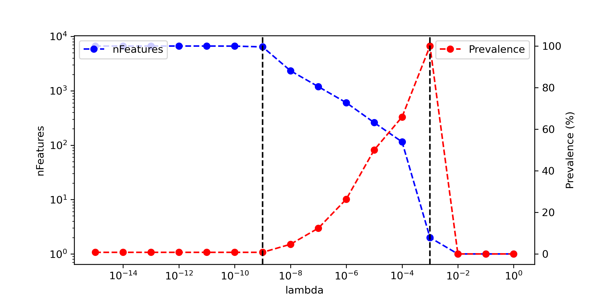

PreLectR
================
YinCheng Chen
December 3, 2024

<!-- README.md is generated from README.Rmd. Please edit that file -->

`PreLectR` is an R package implementing the PreLect algorithm for
feature engineering in sparse data. It supports four tasks:
`binary classification`, `multi-class classification`, `regression`, and
`time-to-event` analysis. The package leverages `RcppArmadillo` and
`parallel` for enhanced performance. For 16S amplicon data, PreLectR
provides a seamless workflow to integrate with DADA2 and includes
downstream functional enrichment analysis using `PICRUSt2`, ensuring a
user-friendly experience.

# Table of Contents

- [Installation](#Installation)
- [General usage](#general-usage)
- [Special tasks](#lambda-tuning)
- [16s amplicon bioinfoermation workflow](#selection-profile)
- [Authors](#authors)
- [Found a Bug](#found-a-bug)

## Installation

`PreLectR` can be installed from GitHub using:

``` r
install.packages("remotes")
remotes::install_github("YinchengChen23/PreLectR")
```

Package dependencies: - for model estimation: `Rcpp` and
`RcppArmadillo` - for parallel computing: `parallel`, `doParallel`,
`foreach` - for graphical purposes: `ggplot2` and `patchwork` - for
functional enrichment analysis KEGG : `KEGGREST`

<figure>

<figcaption aria-hidden="true">R logo</figcaption>
</figure>

## General usage

$$
f(t) = h_0(t)\cdot\ e^{xw}  
$$
