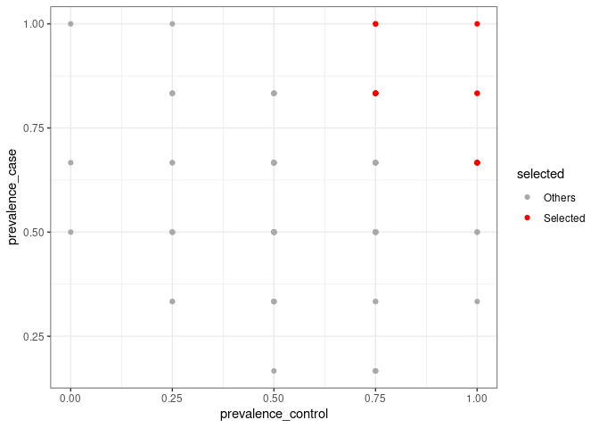

PreLectR
================
Yin Cheng Chen
Created on 05 Dec, 2024 <br>Last compiled on 05 Dec, 2024

`PreLectR` is an R package implementing the PreLect algorithm for
feature engineering in sparse data. It supports four tasks: binary
classification, multi-class classification, regression, and
time-to-event analysis. The package leverages `RcppArmadillo` and
`parallel` for enhanced performance. For 16S amplicon data, PreLectR
provides a seamless workflow to integrate with DADA2 and includes
downstream functional enrichment analysis using `PICRUSt2`, ensuring a
user-friendly experience.

# Table of Contents

- [Installation](#in)
- [General usage](#gu)
- [Special tasks](#st)
- [Tutorial for amplicon data](#ta)
- [Found a Bug](#fb)

------------------------------------------------------------------------

## Installation

`PreLectR` can be installed from GitHub using:

``` r
install.packages("remotes")
remotes::install_github("YinchengChen23/PreLectR")
```

#### Package Dependencies

- **For model estimation**: `Rcpp` and `RcppArmadillo`
- **For parallel computing**: `parallel`, `doParallel`, `foreach`
- **For graphical purposes**: `ggplot2` and `patchwork`
- **For functional enrichment analysis (KEGG)**: `KEGGREST`

Due to the use of `RcppArmadillo` and `Rcpp` for compilation, window
users may fail to install.

------------------------------------------------------------------------

## General usage

#### Automatically Lambda Scanning

The Lasso base method has a hyperparameter, `lambda`, which represents
the regularization intensity that needs to be set.

$J(\mathbf{w}) = \text{BCE}(\mathbf{y}, \hat{\mathbf{y}}) + \color{red}{\lambda} \sum_j \frac{|\mathbf{w}_j|}{p_j}$

Unlike common strategies for parameter tuning (based on performance), we
propose a method to determine the parameter based on the variation of
the loss value. We propose determining the optimal lambda value based on
the inflection point of the loss curve. This point marks the crucial
balance where the regularization term outweighs the loss term.


So we design a function `AutoScanning` which can automatically scan the
lambda from from $10^{-10}$ to $10^{-1}$, and identify the upper and
lower boundaries representing lasso start filtering and lasso drop all
features respectively (black dotted line). And divide `k` parts whitin
this region as the examining lambdas.


``` r
library(PreLectR)
library(patchwork)
library(ggplot2)

set.seed(42)
n_samples <- 10
n_features <- 100
 
X_raw <- matrix(rnbinom(n_features * n_samples, size = 10, mu = 1), nrow = n_features, ncol = n_samples)
print(dim(X_raw))
```

    [1] 100  10

``` r
# feature-wise z-standardization
X_scaled <- t(scale(t(X_raw)))
diagnosis <- c('CRC','CRC','control','CRC','control','CRC','control','control','CRC','CRC')

# assign the control-sample at the first order of levels in factor function
diagnosis <- factor(diagnosis, levels = c('control', 'CRC'))

                                         # task = "classification" OR "regression"
lrange <- AutoScanning(X_scaled, X_raw, diagnosis, task = "classification", step=30)
```

      |                                                                              |                                                                      |   0%  |                                                                              |=======                                                               |  10%  |                                                                              |==============                                                        |  20%  |                                                                              |=====================                                                 |  30%  |                                                                              |============================                                          |  40%  |                                                                              |===================================                                   |  50%  |                                                                              |==========================================                            |  60%  |                                                                              |=================================================                     |  70%  |                                                                              |========================================================              |  80%  |                                                                              |===============================================================       |  90%  |                                                                              |======================================================================| 100%

``` r
print(exp(lrange))
```

     [1] 0.0001000000 0.0001172102 0.0001373824 0.0001610262 0.0001887392
     [6] 0.0002212216 0.0002592944 0.0003039195 0.0003562248 0.0004175319
    [11] 0.0004893901 0.0005736153 0.0006723358 0.0007880463 0.0009236709
    [16] 0.0010826367 0.0012689610 0.0014873521 0.0017433288 0.0020433597
    [21] 0.0023950266 0.0028072162 0.0032903446 0.0038566204 0.0045203537
    [26] 0.0052983169 0.0062101694 0.0072789538 0.0085316785 0.0100000000

### Lambda Tuning for Feature Selection

Next, we examine each testing lambda by assessing feature prevalence and
calculating various performance metrics using the `LambdaTuning`
function with a 7/3 train-test split.

Since this procedure is time-consuming, we suggest running it with
`nohup` if it takes too long. We also provide an `outpath` option to
save the results to a folder of your choice.”

Alternatively, if parallel computing is available on your PC, you can
also use `LambdaTuningParallel` to accelerate the calculation process.

``` r
output_dir <- '/home/yincheng23/Course/PLdemo/try1'                # task = "classification" OR "regression"
tuning_res <- LambdaTuning(X_scaled, X_raw, diagnosis, lrange, outpath=output_dir, spl_ratio=0.7, task="classification")
```

      |                                                                              |                                                                      |   0%

    Warning in predict.lm(object, newdata, se.fit, scale = 1, type = if (type == :
    prediction from a rank-deficient fit may be misleading

      |                                                                              |==                                                                    |   3%

    Warning in predict.lm(object, newdata, se.fit, scale = 1, type = if (type == :
    prediction from a rank-deficient fit may be misleading

      |                                                                              |=====                                                                 |   7%

    Warning in predict.lm(object, newdata, se.fit, scale = 1, type = if (type == :
    prediction from a rank-deficient fit may be misleading

      |                                                                              |=======                                                               |  10%

    Warning in predict.lm(object, newdata, se.fit, scale = 1, type = if (type == :
    prediction from a rank-deficient fit may be misleading

      |                                                                              |=========                                                             |  13%

    Warning in predict.lm(object, newdata, se.fit, scale = 1, type = if (type == :
    prediction from a rank-deficient fit may be misleading

      |                                                                              |============                                                          |  17%

    Warning in predict.lm(object, newdata, se.fit, scale = 1, type = if (type == :
    prediction from a rank-deficient fit may be misleading

      |                                                                              |==============                                                        |  20%

    Warning in predict.lm(object, newdata, se.fit, scale = 1, type = if (type == :
    prediction from a rank-deficient fit may be misleading

      |                                                                              |================                                                      |  23%

    Warning in predict.lm(object, newdata, se.fit, scale = 1, type = if (type == :
    prediction from a rank-deficient fit may be misleading

      |                                                                              |===================                                                   |  27%

    Warning in predict.lm(object, newdata, se.fit, scale = 1, type = if (type == :
    prediction from a rank-deficient fit may be misleading

      |                                                                              |=====================                                                 |  30%

    Warning in predict.lm(object, newdata, se.fit, scale = 1, type = if (type == :
    prediction from a rank-deficient fit may be misleading

      |                                                                              |=======================                                               |  33%

    Warning in predict.lm(object, newdata, se.fit, scale = 1, type = if (type == :
    prediction from a rank-deficient fit may be misleading

      |                                                                              |==========================                                            |  37%

    Warning in predict.lm(object, newdata, se.fit, scale = 1, type = if (type == :
    prediction from a rank-deficient fit may be misleading

      |                                                                              |============================                                          |  40%

    Warning in predict.lm(object, newdata, se.fit, scale = 1, type = if (type == :
    prediction from a rank-deficient fit may be misleading

      |                                                                              |==============================                                        |  43%  |                                                                              |=================================                                     |  47%  |                                                                              |===================================                                   |  50%  |                                                                              |=====================================                                 |  53%  |                                                                              |========================================                              |  57%  |                                                                              |==========================================                            |  60%  |                                                                              |============================================                          |  63%  |                                                                              |===============================================                       |  67%  |                                                                              |=================================================                     |  70%  |                                                                              |===================================================                   |  73%  |                                                                              |======================================================                |  77%  |                                                                              |========================================================              |  80%  |                                                                              |==========================================================            |  83%  |                                                                              |=============================================================         |  87%  |                                                                              |===============================================================       |  90%  |                                                                              |=================================================================     |  93%  |                                                                              |====================================================================  |  97%  |                                                                              |======================================================================| 100%

``` r
print(dir(output_dir))
```

    [1] "Pvl_distribution.csv" "TuningResult.csv"    

``` r
# Parallel computing
# tuning_res <- LambdaTuningParallel(X_scaled, X_raw, diagnosis, lrange, n_cores=10, outpath=output_dir, spl_ratio=0.7)
```

``` r
head(tuning_res$TuningResult)
```

      Feature_number Percentage Prevalence  AUC loss_history error_history
    1             26       0.26        0.7 0.25  0.002192383  0.0001968038
    2             23       0.23        0.7 1.00  0.002446654  0.0001842963
    3             22       0.22        0.7 1.00  0.002823790  0.0001826157
    4             21       0.21        0.7 1.00  0.003294346  0.0002019210
    5             20       0.20        0.7 1.00  0.003827315  0.0002130905
    6             17       0.17        0.8 1.00  0.004409772  0.0002122248
        loglmbd
    1 -9.210340
    2 -9.051541
    3 -8.892742
    4 -8.733943
    5 -8.575144
    6 -8.416346

``` r
head(tuning_res$PvlDistSummary)
```

          llmbd max  q3   q2  q1 min
    1 -9.210340   1 0.8 0.70 0.6   0
    2 -9.051541   1 0.8 0.70 0.6   0
    3 -8.892742   1 0.8 0.70 0.6   0
    4 -8.733943   1 0.8 0.70 0.6   0
    5 -8.575144   1 0.8 0.70 0.6   0
    6 -8.416346   1 0.8 0.75 0.6   0

``` r
# recall the tuning result
TuningResult <- read.csv(paste0(output_dir,'/TuningResult.csv'))
PvlDistSummary <- read.csv(paste0(output_dir,'/Pvl_distribution.csv'))
```

### Optimal Lambda Decision

Determines the optimal lambda value based on the inflection point of the
loss curve, which represents the critical balance where the
regularization term begins to outweigh the loss term. This function,
`LambdaDecision`, finds the inflection point by segmenting the loss
curve into n parts through segmented regression.

Segmented regression is implemented using
`Recursive Partitioning and Regression Trees`, selecting the first
breakpoint as the optimal lambda.

``` r
# recall the tuning result
lmbd_picking <- LambdaDecision(tuning_res$TuningResult, tuning_res$PvlDistSummar, maxdepth=5, minbucket=3)

# optimal lambda
print(lmbd_picking$opt_lmbd)
```

    [1] 0.0004893901

``` r
lmbd_picking$selected_lmbd_plot/lmbd_picking$pvl_plot
```

    Warning: Removed 15 rows containing missing values (`geom_point()`).

<!-- -->

### Feature selection

``` r
rownames(X_scaled) <- sprintf(paste0("ASV%0", 3, "d"), 1:nrow(X_scaled))

prevalence <- GetPrevalence(X_raw)

s=Sys.time()
PreLect_out <- PreLect(X_scaled, prevalence, diagnosis, lambda=lmbd_picking$opt_lmbd, task="classification")
print(Sys.time()-s)
```

    Time difference of 0.03870034 secs

``` r
featpropt <- FeatureProperty(X_raw, diagnosis, PreLect_out, task="classification")

print(paste(nrow(featpropt[featpropt$selected == 'Selected', ]), 'features were selected'))
```

    [1] "18 features were selected"

``` r
print(paste('median of prevalence :', median(featpropt$prevalence[featpropt$selected == 'Selected'])))
```

    [1] "median of prevalence : 0.8"

``` r
head(featpropt)
```

      FeatName       coef tendency selected meanAbundance  variance prevalence
    1   ASV001 0.00000000     <NA>   Others   0.008416600 0.6222222        0.6
    2   ASV002 0.07874118      CRC Selected   0.010762651 0.7666667        0.8
    3   ASV003 0.00000000     <NA>   Others   0.008250469 0.8444444        0.6
    4   ASV004 0.00000000     <NA>   Others   0.008264423 1.2888889        0.4
    5   ASV005 0.00000000     <NA>   Others   0.009922380 0.6666667        0.7
    6   ASV006 0.00000000     <NA>   Others   0.006255906 0.2666667        0.6
      prevalence_case prevalence_control      logFC
    1       0.8333333               0.25  0.4150375
    2       0.8333333               0.75 -0.1699250
    3       0.6666667               0.50  0.4150375
    4       0.5000000               0.25  0.0671142
    5       0.6666667               0.75  0.0000000
    6       0.5000000               0.75 -0.2223924

### Selection profile visualization

``` r
ggplot(featpropt, aes(x = prevalence, y = meanAbundance, color=selected)) + geom_point() +
  scale_color_manual(values = c('Selected'='red', 'Others'='#AAAAAA')) +
  theme_bw()+ theme(panel.background = element_rect(fill = "white", colour = "white"))
```

<!-- -->

``` r
ggplot(featpropt, aes(x = prevalence, y = variance, color=selected)) + geom_point() +
  scale_color_manual(values = c('Selected'='red', 'Others'='#AAAAAA')) +
  coord_trans(y = "log10") +
  theme_bw()+ theme(panel.background = element_rect(fill = "white", colour = "white"))
```

<!-- -->

``` r
ggplot(featpropt, aes(x = prevalence_control, y = prevalence_case, color=selected)) + geom_point() +
  scale_color_manual(values = c('Selected'='red', 'Others'='#AAAAAA')) +
  theme_bw()+ theme(panel.background = element_rect(fill = "white", colour = "white"))
```

<!-- -->

------------------------------------------------------------------------

## Special tasks

`PreLectR` is an R package implementing the PreLect algorithm for
feature engineering in sparse data. It supports four tasks, the
objective for four task are following function:

$\text{Binary classification} : J(\mathbf{w}) = \text{BCE}(\mathbf{y}, \hat{\mathbf{y}}) + \color{red}{\lambda \sum_j \frac{|\mathbf{w}_j|}{p_j}}$

$\text{Regression} : J(\mathbf{w}) = \text{MSE}(\mathbf{y}, \hat{\mathbf{y}}) + \color{red}{\lambda \sum_j \frac{|\mathbf{w}_j|}{p_j}}$

$\text{Multi-class classification} : J(\mathbf{w}) = \frac{1}{c} \sum_{l=1}^{c} \left( \text{BCE}(\mathbf{y}_l, \hat{\mathbf{y}}_l) + \color{red}{\lambda \sum_{j=1}^{d}\frac{|\mathbf{w}_{j,l}|}{p_{j,l}}} \right)$

$\text{Time-to-event} : J(\mathbf{w}) = h_0(t) \cdot e^{\sum{x_i \cdot w}}+ \color{red}{\lambda \sum_j \frac{|\mathbf{w}_j|}{p_j}}$

Function usage in different tasks :

| Task              | Binary classification | Regression           | Multi-class classification     | Time-to-event              |
|-------------------|-----------------------|----------------------|--------------------------------|----------------------------|
| Step 1            | AutoScanning          | AutoScanning         | AutoScanningMultiClass         | AutoScanningCoxPH          |
| Step 2            | LambdaTuning          | LambdaTuning         | LambdaTuningMultiClass         | LambdaTuningCoxPH          |
| Step 2 (optional) | LambdaTuningParallel  | LambdaTuningParallel | LambdaTuningMultiClassParallel | LambdaTuningCoxPHParallel  |
| Step 3            | LambdaDecision        | LambdaDecision       | LambdaDecision                 | LambdaDecision             |
| Step 4            | PreLect               | PreLect              | PreLectMultiClass              | PreLectCoxPH               |
| Step 5            | FeatureProperty       | FeatureProperty      | FeatureProperty                | FeatureProperty            |
| Step 5            | TaxaProperty          | TaxaProperty         | Nan                            | TaxaProperty               |
| Step 6            | GSEATestwithFC        | GSEATest             | Nan                            | GSEATestwithFC or GSEATest |

Please use help for detailed instructions on how to specify arguments,
sure like `?AutoScanningCoxPH`

## Tutorial for amplicon data

Please ensure the following package are installed : `learnr`, `shiny`,
`DESeq2`, `patchwork`, `PreLectR`. And Run the Rmarkdown file
[amplicon_tutorial.Rmd](https://github.com/YinchengChen23/PreLectR/blob/main/Notebook/amplicon_tutorial.Rmd)
at local.

------------------------------------------------------------------------

## Found a Bug

Or would like a feature added? Or maybe drop some feedback? Just [open a
new issue](https://github.com/YinchengChen23/PreLect/issues/new) or send
an email to us (<yin.cheng.23@gmail.com>).
