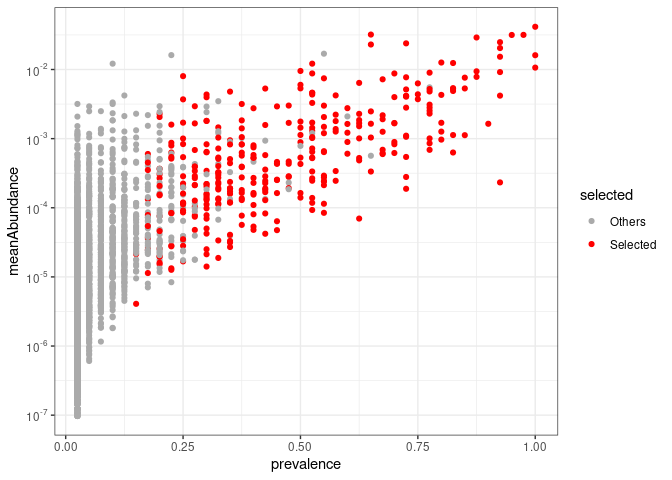

PreLectR
================
Yin Cheng Chen
Created on 05 Dec, 2024 <br>Last compiled on 18 Dec, 2024

`PreLectR` is an R package implementing the PreLect algorithm for
feature engineering in sparse data. It supports four tasks: binary
classification, multi-class classification, regression, and
time-to-event analysis. The package leverages `RcppArmadillo` and
`parallel` for enhanced performance. For 16S amplicon data, PreLectR
provides a seamless workflow to integrate with DADA2 and includes
downstream functional enrichment analysis using `PICRUSt2`, ensuring a
user-friendly experience.

# Table of Contents

- [Installation](#in)
- [General usage](#gu)
- [Special tasks](#st)
- [Tutorial for amplicon data](#ta)
- [Found a Bug](#fb)

------------------------------------------------------------------------

<span id="in"> </span>

## Installation

`PreLectR` can be installed from GitHub using:

``` r
install.packages("remotes")
remotes::install_github("YinchengChen23/PreLectR")
```

#### Package Dependencies

- **For model estimation**: `Rcpp` and `RcppArmadillo`
- **For parallel computing**: `parallel`, `doParallel`, `foreach`
- **For graphical purposes**: `ggplot2` and `patchwork`

Due to the use of `RcppArmadillo` and `Rcpp` for compilation, window
users may fail to install.

------------------------------------------------------------------------

<span id="gu"> </span>

## General usage

#### Automatically Lambda Scanning

The Lasso base method has a hyperparameter, `lambda`, which represents
the regularization intensity that needs to be set.

$J(\mathbf{w}) = \text{BCE}(\mathbf{y}, \hat{\mathbf{y}}) + \color{red}{\lambda} \sum_j \frac{|\mathbf{w}_j|}{p_j}$

Unlike common strategies for parameter tuning (based on performance), we
propose a method to determine the parameter based on the variation of
the loss value. We propose determining the optimal lambda value based on
the inflection point of the loss curve. This point marks the crucial
balance where the regularization term outweighs the loss term.


So we design a function `AutoScanning` which can automatically scan the
lambda from from $10^{-10}$ to $10^{-1}$, and identify the upper and
lower boundaries representing lasso start filtering and lasso drop all
features respectively (black dotted line). And divide `k` parts whitin
this region as the examining lambdas.


``` r
library(PreLectR)
library(patchwork)
library(ggplot2)

set.seed(42)
n_samples <- 10
n_features <- 100
 
X_raw <- matrix(rnbinom(n_features * n_samples, size = 10, mu = 1), nrow = n_features, ncol = n_samples)
print(dim(X_raw))
[1] 100  10

# feature-wise z-standardization
X_scaled <- t(scale(t(X_raw)))
diagnosis <- c('CRC','CRC','control','CRC','control','CRC','control','control','CRC','CRC')

# assign the control-sample at the first order of levels in factor function
diagnosis <- factor(diagnosis, levels = c('control', 'CRC'))

                                         # task = "classification" OR "regression"
lrange <- AutoScanning(X_scaled, X_raw, diagnosis, task = "classification", step=30)
  |                                                                              |                                                                      |   0%  |                                                                              |=======                                                               |  10%  |                                                                              |==============                                                        |  20%  |                                                                              |=====================                                                 |  30%  |                                                                              |============================                                          |  40%  |                                                                              |===================================                                   |  50%  |                                                                              |==========================================                            |  60%  |                                                                              |=================================================                     |  70%  |                                                                              |========================================================              |  80%  |                                                                              |===============================================================       |  90%  |                                                                              |======================================================================| 100%

print(exp(lrange))
 [1] 0.0001000000 0.0001172102 0.0001373824 0.0001610262 0.0001887392
 [6] 0.0002212216 0.0002592944 0.0003039195 0.0003562248 0.0004175319
[11] 0.0004893901 0.0005736153 0.0006723358 0.0007880463 0.0009236709
[16] 0.0010826367 0.0012689610 0.0014873521 0.0017433288 0.0020433597
[21] 0.0023950266 0.0028072162 0.0032903446 0.0038566204 0.0045203537
[26] 0.0052983169 0.0062101694 0.0072789538 0.0085316785 0.0100000000
```

### Lambda Tuning for Feature Selection

Next, we examine each testing lambda by assessing feature prevalence and
calculating various performance metrics using the `LambdaTuning`
function with a 7/3 train-test split.

Since this procedure is time-consuming, we suggest running it with
`nohup` if it takes too long. We also provide an `outpath` option to
save the results to a folder of your choice.”

Alternatively, if parallel computing is available on your PC, you can
also use `LambdaTuningParallel` to accelerate the calculation process.

``` r
output_dir <- '/home/yincheng23/Course/PLdemo/try1'                # task = "classification" OR "regression"
tuning_res <- LambdaTuning(X_scaled, X_raw, diagnosis, lrange, outpath=output_dir, spl_ratio=0.7, task="classification")
  |                                                                              |                                                                      |   0%  |                                                                              |==                                                                    |   3%  |                                                                              |=====                                                                 |   7%  |                                                                              |=======                                                               |  10%  |                                                                              |=========                                                             |  13%  |                                                                              |============                                                          |  17%  |                                                                              |==============                                                        |  20%  |                                                                              |================                                                      |  23%  |                                                                              |===================                                                   |  27%  |                                                                              |=====================                                                 |  30%  |                                                                              |=======================                                               |  33%  |                                                                              |==========================                                            |  37%  |                                                                              |============================                                          |  40%  |                                                                              |==============================                                        |  43%  |                                                                              |=================================                                     |  47%  |                                                                              |===================================                                   |  50%  |                                                                              |=====================================                                 |  53%  |                                                                              |========================================                              |  57%  |                                                                              |==========================================                            |  60%  |                                                                              |============================================                          |  63%  |                                                                              |===============================================                       |  67%  |                                                                              |=================================================                     |  70%  |                                                                              |===================================================                   |  73%  |                                                                              |======================================================                |  77%  |                                                                              |========================================================              |  80%  |                                                                              |==========================================================            |  83%  |                                                                              |=============================================================         |  87%  |                                                                              |===============================================================       |  90%  |                                                                              |=================================================================     |  93%  |                                                                              |====================================================================  |  97%  |                                                                              |======================================================================| 100%


print(dir(output_dir))
[1] "Pvl_distribution.csv" "TuningResult.csv"    

# Parallel computing
# tuning_res <- LambdaTuningParallel(X_scaled, X_raw, diagnosis, lrange, n_cores=10, outpath=output_dir, spl_ratio=0.7)
```

``` r
head(tuning_res$TuningResult)
```

      Feature_number Percentage Prevalence  AUC loss_history error_history
    1             26       0.26        0.7 0.25  0.002192383  0.0001968038
    2             23       0.23        0.7 1.00  0.002446654  0.0001842963
    3             22       0.22        0.7 1.00  0.002823790  0.0001826157
    4             21       0.21        0.7 1.00  0.003294346  0.0002019210
    5             20       0.20        0.7 1.00  0.003827315  0.0002130905
    6             17       0.17        0.8 1.00  0.004409772  0.0002122248
        loglmbd
    1 -9.210340
    2 -9.051541
    3 -8.892742
    4 -8.733943
    5 -8.575144
    6 -8.416346

``` r
head(tuning_res$PvlDistSummary)
```

          llmbd max  q3   q2  q1 min
    1 -9.210340   1 0.8 0.70 0.6   0
    2 -9.051541   1 0.8 0.70 0.6   0
    3 -8.892742   1 0.8 0.70 0.6   0
    4 -8.733943   1 0.8 0.70 0.6   0
    5 -8.575144   1 0.8 0.70 0.6   0
    6 -8.416346   1 0.8 0.75 0.6   0

If you run the tuning process from the command line, you can retrieve
the results using `read.csv`.

``` r
# recall the tuning result
TuningResult <- read.csv(paste0(output_dir,'/TuningResult.csv'))
PvlDistSummary <- read.csv(paste0(output_dir,'/Pvl_distribution.csv'))
```

### Optimal Lambda Decision

Determines the optimal lambda value based on the inflection point of the
loss curve, which represents the critical balance where the
regularization term begins to outweigh the loss term. This function,
`LambdaDecision`, finds the inflection point by segmenting the loss
curve into n parts through segmented regression.

Segmented regression is implemented using
`Recursive Partitioning and Regression Trees`, selecting the first
breakpoint as the optimal lambda.

``` r
# recall the tuning result
lmbd_picking <- LambdaDecision(tuning_res$TuningResult, tuning_res$PvlDistSummar, maxdepth=5, minbucket=3)

# optimal lambda
print(lmbd_picking$opt_lmbd)
[1] 0.0004893901

lmbd_picking$selected_lmbd_plot/lmbd_picking$pvl_plot
```

<!-- -->

### Feature selection

``` r
rownames(X_scaled) <- sprintf(paste0("ASV%0", 3, "d"), 1:nrow(X_scaled))

prevalence <- GetPrevalence(X_raw)

s=Sys.time()
PreLect_out <- PreLect(X_scaled, prevalence, diagnosis, lambda=lmbd_picking$opt_lmbd, task="classification")
print(Sys.time()-s)
Time difference of 0.02793145 secs


featpropt <- FeatureProperty(X_raw, diagnosis, PreLect_out, task="classification")

print(paste(nrow(featpropt[featpropt$selected == 'Selected', ]), 'features were selected'))
[1] "18 features were selected"

print(paste('median of prevalence :', median(featpropt$prevalence[featpropt$selected == 'Selected'])))
[1] "median of prevalence : 0.8"


head(featpropt)
  FeatName       coef tendency selected meanAbundance  variance prevalence
1   ASV001 0.00000000     <NA>   Others   0.008416600 0.6222222        0.6
2   ASV002 0.07874118      CRC Selected   0.010762651 0.7666667        0.8
3   ASV003 0.00000000     <NA>   Others   0.008250469 0.8444444        0.6
4   ASV004 0.00000000     <NA>   Others   0.008264423 1.2888889        0.4
5   ASV005 0.00000000     <NA>   Others   0.009922380 0.6666667        0.7
6   ASV006 0.00000000     <NA>   Others   0.006255906 0.2666667        0.6
  prevalence_case prevalence_control      logFC
1       0.8333333               0.25  0.4150375
2       0.8333333               0.75 -0.1699250
3       0.6666667               0.50  0.4150375
4       0.5000000               0.25  0.0671142
5       0.6666667               0.75  0.0000000
6       0.5000000               0.75 -0.2223924
```

### Selection profile visualization

``` r
ggplot(featpropt, aes(x = prevalence, y = meanAbundance, color=selected)) + geom_point() +
  scale_color_manual(values = c('Selected'='red', 'Others'='#AAAAAA')) +
  theme_bw()+ theme(panel.background = element_rect(fill = "white", colour = "white"))
```

<!-- -->

``` r
ggplot(featpropt, aes(x = prevalence, y = variance, color=selected)) + geom_point() +
  scale_color_manual(values = c('Selected'='red', 'Others'='#AAAAAA')) +
  coord_trans(y = "log10") +
  theme_bw()+ theme(panel.background = element_rect(fill = "white", colour = "white"))
```

<!-- -->

``` r
ggplot(featpropt, aes(x = prevalence_control, y = prevalence_case, color=selected)) + geom_point() +
  scale_color_manual(values = c('Selected'='red', 'Others'='#AAAAAA')) +
  theme_bw()+ theme(panel.background = element_rect(fill = "white", colour = "white"))
```

<!-- -->

------------------------------------------------------------------------

<span id="st"> </span>

## Special tasks

`PreLectR` is an R package implementing the PreLect algorithm for
feature engineering in sparse data. It supports four tasks, the
objective for four task are following function:

$\text{Binary classification} : J(\mathbf{w}) = \text{BCE}(\mathbf{y}, \hat{\mathbf{y}}) + \color{red}{\lambda \sum_j \frac{|\mathbf{w}_j|}{p_j}}$

$\text{Regression} : J(\mathbf{w}) = \text{MSE}(\mathbf{y}, \hat{\mathbf{y}}) + \color{red}{\lambda \sum_j \frac{|\mathbf{w}_j|}{p_j}}$

$\text{Multi-class classification} : J(\mathbf{w}) = \frac{1}{c} \sum_{l=1}^{c} \left( \text{BCE}(\mathbf{y}_l, \hat{\mathbf{y}}_l) + \color{red}{\lambda \sum_{j=1}^{d}\frac{|\mathbf{w}_{j,l}|}{p_{j,l}}} \right)$

$\text{Time-to-event} : J(\mathbf{w}) = h_0(t) \cdot e^{\sum{x_i \cdot w}}+ \color{red}{\lambda \sum_j \frac{|\mathbf{w}_j|}{p_j}}$

Function usage in different tasks :

| Task              | Binary classification | Regression           | Multi-class classification     | Time-to-event              |
|-------------------|-----------------------|----------------------|--------------------------------|----------------------------|
| Step 1            | AutoScanning          | AutoScanning         | AutoScanningMultiClass         | AutoScanningCoxPH          |
| Step 2            | LambdaTuning          | LambdaTuning         | LambdaTuningMultiClass         | LambdaTuningCoxPH          |
| Step 2 (optional) | LambdaTuningParallel  | LambdaTuningParallel | LambdaTuningMultiClassParallel | LambdaTuningCoxPHParallel  |
| Step 3            | LambdaDecision        | LambdaDecision       | LambdaDecision                 | LambdaDecision             |
| Step 4            | PreLect               | PreLect              | PreLectMultiClass              | PreLectCoxPH               |
| Step 5            | FeatureProperty       | FeatureProperty      | FeatureProperty                | FeatureProperty            |
| Step 6            | TaxaProperty          | TaxaProperty         | Nan                            | TaxaProperty               |
| Step 7            | GSEATestwithFC        | GSEATest             | Nan                            | GSEATestwithFC or GSEATest |

Please use help for detailed instructions on how to specify arguments,
sure like `?AutoScanningCoxPH`

<span id="ta"> </span>

## Tutorial for amplicon data

Please ensure the following package are installed : `DESeq2`,
`patchwork`, `PreLectR`.

We subsetted a CRC study dataset from Zeller et al. 2014, including 20
patients each from the normal and cancer groups, and used the DADA2
pipeline to complete the analysis up to the taxonomic assignment step.

``` r
library(PreLectR)
library(patchwork)
library(ggplot2)

dataset_path <- system.file("exdata", "Zeller_CRC.RData", package = "PreLectR")
if (file.exists(dataset_path)) {
  load(dataset_path)
} else {
  stop("Zeller_CRC.RData not found!")
}
print(ls())
[1] "dataset_path"  "meta"          "seqtab"        "seqtab.nochim"
[5] "taxa"          "track"        

# Check patients condition
print(table(meta$Class))

Cancer Normal 
    20     20 
print(table(meta$diagnosis))   # for multi-class classification

Adenoma  Cancer  Normal 
      6      20      14 

# The clinical factor for time-to-event testing
meta$event <- ifelse(meta$Class == 'Cancer', 1, 0)  # as events
meta$duration <- meta$age                           # as duration
```

We designed the `DADA2Adapter` function to bridge the data into the
`PreLect` pipeline.

``` r
# set the working  directory 
output_path <- '/home/yincheng23/Course/PLdemo/try2'

# generate the raw count table, taxa table and ASV sequence fasta
DADA2Adapter(seqtab.nochim, taxa, output_path)
dir(output_path)
[1] "ASV_table.txt"      "ASV_taxa_table.txt" "ASV.fasta"         
[4] "PICRUSt2"          
```

Based on [previous
studies](https://www.nature.com/articles/s41467-021-23821-6), we
recommend using variance-stabilizing transformation (VST) for data
normalization.

``` r
# load the data we need
data <- read.csv(paste0(output_path,'/ASV_table.txt'), sep = '\t')
taxa <- read.csv(paste0(output_path,'/ASV_taxa_table.txt'), sep = '\t')

# Variance Stabilization Transformation
library(DESeq2)
data_pseudo_count <- data + 1
meta$Class <- factor(meta$Class)

dds <- DESeqDataSetFromMatrix(countData = data_pseudo_count,
                              colData = meta,
                              ~ Class)

vst <- varianceStabilizingTransformation(dds, fitType="mean", blind= T)

vst_table <- assay(vst)

# feature-wise z-standardization
data_scaled <- t(scale(t(as.matrix(vst_table))))
```

We will only use z-standardized table `data_scaled` and raw count table
`data` for the subsequent analyses.

### Automatically lambda scanning and lambda yuning

Automatically perform lambda scanning to identify 30 lambda values for
examination.

``` r
meta$Class <- factor(meta$Class, levels = c("Normal", "Cancer"))  # assign "Normal" as control sample
lrange <- AutoScanning(data_scaled, data, meta$Class, step =30)
  |                                                                              |                                                                      |   0%  |                                                                              |=======                                                               |  10%  |                                                                              |==============                                                        |  20%  |                                                                              |=====================                                                 |  30%  |                                                                              |============================                                          |  40%  |                                                                              |===================================                                   |  50%  |                                                                              |==========================================                            |  60%  |                                                                              |=================================================                     |  70%  |                                                                              |========================================================              |  80%  |                                                                              |===============================================================       |  90%  |                                                                              |======================================================================| 100%
length(lrange)
[1] 30
exp(lrange)
 [1] 1.000000e-07 1.487352e-07 2.212216e-07 3.290345e-07 4.893901e-07
 [6] 7.278954e-07 1.082637e-06 1.610262e-06 2.395027e-06 3.562248e-06
[11] 5.298317e-06 7.880463e-06 1.172102e-05 1.743329e-05 2.592944e-05
[16] 3.856620e-05 5.736153e-05 8.531679e-05 1.268961e-04 1.887392e-04
[21] 2.807216e-04 4.175319e-04 6.210169e-04 9.236709e-04 1.373824e-03
[26] 2.043360e-03 3.039195e-03 4.520354e-03 6.723358e-03 1.000000e-02
```

Examining the testing lambda.

``` r
tuning_res <- LambdaTuningParallel(data_scaled, data, meta$Class, lrange, n_cores=10, outpath=output_path)
```

``` r
head(tuning_res$TuningResult)
```

      Feature_number Percentage Prevalence       AUC loss_history error_history
    1           1117  0.3074594      0.125 0.5833333 0.0003106709  9.988101e-05
    2           1031  0.2837875      0.150 0.5833333 0.0003227630  9.999013e-05
    3            990  0.2725021      0.150 0.5833333 0.0003166616  9.999740e-05
    4            841  0.2314891      0.200 0.5000000 0.0003186614  9.999711e-05
    5            697  0.1918525      0.225 0.5000000 0.0003321094  9.990173e-05
    6            587  0.1615745      0.275 0.4583333 0.0003385031  9.999504e-05
        loglmbd
    1 -16.11810
    2 -15.72110
    3 -15.32410
    4 -14.92710
    5 -14.53011
    6 -14.13311

``` r
head(tuning_res$PvlDistSummary)
```

          llmbd max    q3    q2    q1 min
    1 -16.11810   1 0.300 0.125 0.075   0
    2 -15.72110   1 0.325 0.150 0.075   0
    3 -15.32410   1 0.325 0.150 0.075   0
    4 -14.92710   1 0.375 0.200 0.100   0
    5 -14.53011   1 0.425 0.225 0.125   0
    6 -14.13311   1 0.475 0.275 0.150   0

### Optimal lambda decision and feature selection

Determine the optimal lambda by partitioning tree.

``` r
lmbd_picking <- LambdaDecision(tuning_res$TuningResult, tuning_res$PvlDistSummary, maxdepth=5, minbucket=3)

lmbd_picking$selected_lmbd_plot/lmbd_picking$pvl_plot
```

<!-- -->

``` r

print(lmbd_picking$opt_lmbd)
[1] 2.395027e-06
```

PreLect execution and get the property for each feature

``` r
prevalence <- GetPrevalence(data)

s=Sys.time()
PreLect_out <- PreLect(data_scaled, prevalence, meta$Class, lambda=lmbd_picking$opt_lmbd)
print(Sys.time()-s)
Time difference of 2.208462 secs


featpropt <- FeatureProperty(data, meta$Class, PreLect_out, task="classification")

print(paste(nrow(featpropt[featpropt$selected == 'Selected', ]), 'features were selected'))
[1] "358 features were selected"

print(paste('median of prevalence :', median(featpropt$prevalence[featpropt$selected == 'Selected'])))
[1] "median of prevalence : 0.4"

head(featpropt)
        FeatName        coef tendency selected meanAbundance   variance
ASV0001  ASV0001  0.53151508   Cancer Selected    0.04150302  117734960
ASV0002  ASV0002 -0.41757598   Normal Selected    0.03167390   64237504
ASV0003  ASV0003  0.00000000     <NA>   Others    0.01213962 1555924984
ASV0004  ASV0004 -0.32173040   Normal Selected    0.03201389  288009324
ASV0005  ASV0005 -0.31919123   Normal Selected    0.02903994   41768447
ASV0006  ASV0006 -0.02955327   Normal Selected    0.02485074   72058376
        prevalence prevalence_case prevalence_control      logFC
ASV0001      1.000            1.00               1.00  1.4998663
ASV0002      0.975            0.95               1.00 -0.6884894
ASV0003      0.100            0.05               0.15 11.0217666
ASV0004      0.650            0.60               0.70 -2.6154169
ASV0005      0.875            0.80               0.95  0.6372900
ASV0006      0.925            0.90               0.95 -0.1468191
```

### Selection profile visualization and evaluation

``` r
library(scales)
ggplot(featpropt, aes(x = prevalence, y = meanAbundance, color=selected)) + geom_point() +
  scale_color_manual(values = c('Selected'='red', 'Others'='#AAAAAA')) + 
  scale_y_log10(breaks = trans_breaks("log10", function(x) 10^x),
                labels = trans_format("log10", math_format(10^.x))) +
  theme_bw()+ theme(panel.background = element_rect(fill = "white", colour = "white"))
```

<!-- -->

``` r
y <- ifelse(meta$Class == "Cancer", 1, 0) 

split   <- TrainTextSplit(y)
X_train <- data_scaled[, split$train_idx]
X_test  <- data_scaled[, split$test_idx]
y_train <- y[split$train_idx]
y_test  <- y[split$test_idx]

perf <- evaluation(X_train, y_train, X_test, y_test, featpropt$coef, task='classification')
perf
$AUC
[1] 0.5277778
```

``` r
result <- TaxaProperty(featpropt, taxa, "Family",  pvl_filter = 0.5)

mycolor <- c("Normal" = "#FFCC22", "Cancer" = "#EE7700")
result$effectSizePlot + scale_fill_manual(values = mycolor) +
   geom_hline(yintercept = 0, color='black', linetype='dashed')
```

<!-- -->

``` r


head(result$selectedInfo)
        FeatName       coef tendency selected meanAbundance  variance
ASV0001  ASV0001  0.5315151   Cancer Selected    0.04150302 117734960
ASV0002  ASV0002 -0.4175760   Normal Selected    0.03167390  64237504
ASV0005  ASV0005 -0.3191912   Normal Selected    0.02903994  41768447
ASV0007  ASV0007  1.0081118   Cancer Selected    0.03158703 178336011
ASV0008  ASV0008 -0.2902587   Normal Selected    0.02299001 312317781
ASV0009  ASV0009 -0.4816386   Normal Selected    0.02042962  45214122
        prevalence prevalence_case prevalence_control      logFC
ASV0001      1.000            1.00               1.00  1.4998663
ASV0002      0.975            0.95               1.00 -0.6884894
ASV0005      0.875            0.80               0.95  0.6372900
ASV0007      0.950            1.00               0.90  3.9252053
ASV0008      0.650            0.65               0.65  1.8688587
ASV0009      0.925            0.85               1.00  0.5991814
                      taxa
ASV0001  Sphingomonadaceae
ASV0002    Lachnospiraceae
ASV0005     Bacteroidaceae
ASV0007 Enterobacteriaceae
ASV0008    Akkermansiaceae
ASV0009    Lachnospiraceae
```

### Functional prediction analysis

Prepare files for running PICRUSt2 by extracting the selected ASVs.

``` r
# please ensure the "ASV.fasta" is in "output_path" directory
print(output_path)
[1] "/home/yincheng23/Course/PLdemo/try2"
selected_id <- featpropt$FeatName[featpropt$selected == 'Selected']
data_sub <- data[selected_id, ]
data_sub <- rbind(colnames(data_sub), data_sub)
colnames(data_sub) <- NULL
rownames(data_sub)[1] <- "#OTU ID"
write.table(data_sub, paste0(output_path,"/for_PICRUSt2.tsv"), sep = "\t", quote=F, col.names   =F)
```


Conduct the PICRUSt2 pipeline via docker

``` bash
# Bash
# run the PICRUSt2 pipeline

# ensure the "ASV.fasta" and "for_PICRUSt2.tsv" files are in the same directory 
# and set the working directory to that location before running this script.
cd /home/yincheng23/Course/PLdemo/try2
docker run \
    -it \                          # interactive terminal mode, allowing you to interact with the container.
    --rm \                         # automatically remove the container after it exits to save disk space.
    -v $(pwd):/tmp \               # bind mount the current directory ($(pwd)) to /tmp in the container.
    yincheng23/picrust2:0.2.0 \    # specify the Docker image to use; it will be pulled from Docker Hub if not available locally.
    sh /bin/Run_picrust2.sh 10     # use the shell to execute the built-in script (Run_picrust2.sh) with 10 cores for parallel processing.
    
# the results will store as /home/yincheng23/Course/PLdemo/try2/PICRUSt2
    
```

Since `PICRUSt2` predicts gene abundance based on taxa abundance,
differential expression analysis using this approach may be less
convincing. Therefore, we adopted a `GSEA` strategy, ranking taxa by
fold change based on their abundance. Using insights provided by
`PICRUSt2`, we examined which species carry specific genes to assess the
KOs that are actively expressed or suppressed.


Conduct the GSEA with permutation test via `GSEATestwithFC` or
`GSEATest`

``` r
# load the KO-taxa relationship file
# output_path is the directory you save the for_PICRUSt2.tsv file
KOindex <- read.table(paste0(output_path,"/PICRUSt2/KO/pred_metagenome_contrib.tsv"), sep = "\t", header = TRUE)

# extract the selected ASV identifiers
selected_id <- featpropt$FeatName[featpropt$selected == 'Selected']

# Provide the raw count table for logFC calculation, subsetting with the selected ASVs.
# Additionally, specify the labels for each sample and the name of the case sample group.
GSEAresult <- GSEATestwithFC(KOindex, data[selected_id, ], meta$Class, "Cancer")

## Building the KO-to-taxa mapper...
## Done. In total, 5755 KOs need to be processed.
## Shuffling the labels for GSEA...
## Performing GSEA to identify activated KOs...
##   |============================================================================================================| 100%
## Shuffling the labels for GSEA...
## Performing GSEA to identify suppressed KOs...
##   |============================================================================================================| 100%
## Done.


# If the grouping variable is continuous (e.g., body mass index), use the following line instead:
# GSEAresult <- GSEATest(KOindex, data[selected_id, ], meta$body.mass.index)
```

Selected the enriched KOs with z-score

``` r
Actived_result <- GSEAresult$Actived_KO
Actived_result <- Actived_result[!is.na(Actived_result$z), ]
Actived_result <- Actived_result[Actived_result$z > 2,]
Actived_result <- Actived_result[Actived_result$p < 0.05,]
nrow(Actived_result)
[1] 469
head(Actived_result)
       KO        ES        z     p
16 K09019 0.5439093 2.023025 0.030
24 K13498 0.6471429 2.425284 0.017
38 K13522 0.7359551 2.146245 0.025
42 K10194 0.4500000 2.028016 0.038
57 K00240 0.2728587 2.611608 0.017
59 K18302 0.6751412 2.524061 0.012
```

Since `PICRUSt2` does not provide detailed information for each KO, we
preprocess the KO-pathway table using the KEGG API.

``` r
kodb_path <- system.file("exdata", "total_KO_pathway.rds", package = "PreLectR")
KOinfo <- readRDS(kodb_path)
head(KOinfo)
      KO        symbol                               name    mapid
1 K00001 E1.1.1.1, adh alcohol dehydrogenase [EC:1.1.1.1] map00010
2 K00001 E1.1.1.1, adh alcohol dehydrogenase [EC:1.1.1.1] map00071
3 K00001 E1.1.1.1, adh alcohol dehydrogenase [EC:1.1.1.1] map00350
4 K00001 E1.1.1.1, adh alcohol dehydrogenase [EC:1.1.1.1] map00620
5 K00001 E1.1.1.1, adh alcohol dehydrogenase [EC:1.1.1.1] map00625
6 K00001 E1.1.1.1, adh alcohol dehydrogenase [EC:1.1.1.1] map00626
                                    pathway
1              Glycolysis / Gluconeogenesis
2                    Fatty acid degradation
3                       Tyrosine metabolism
4                       Pyruvate metabolism
5 Chloroalkane and chloroalkene degradation
6                   Naphthalene degradation
```

Examining the condition enriched pathway with Fisher’s exact test via
`PathwayEnrichment`

``` r
KOinfo <- KOinfo[KOinfo$KO %in% unique(KOindex$function.), ]
Actived_result <- GSEAresult$Actived_KO
Actived_result <- Actived_result[!is.na(Actived_result$z), ]
Actived_result <- Actived_result[Actived_result$z > 2,]
Actived_result <- Actived_result[Actived_result$p < 0.05,]
selected_KOs <- Actived_result$KO

enrichPW <- PathwayEnrichment(selected_KOs, KOinfo)
enrichPW$q <- p.adjust(enrichPW$p, method = 'fdr')
enrichPW <- enrichPW[enrichPW$q < 0.05, ]
nrow(enrichPW)
[1] 6

head(enrichPW)
                                                    pathway       id count
14                                Citrate cycle (TCA cycle) map00020    11
22                                   Lipoic acid metabolism map00785     8
25  Biosynthesis of siderophore group nonribosomal peptides map01053     6
30                                    Pyrimidine metabolism map00240    15
109                              Bacterial secretion system map03070    14
110                     Biofilm formation - Vibrio cholerae map05111    14
        ratio            p odds_ratio            q
14  0.2444444 1.141320e-03   3.525195 2.720146e-02
22  0.3636364 2.950988e-04   6.223018 2.109957e-02
25  0.4000000 9.263168e-04   7.303934 2.720146e-02
30  0.2238806 4.536844e-04   3.143378 2.162562e-02
109 0.2153846 1.109857e-03   2.964587 2.720146e-02
110 0.3888889 6.723719e-07   6.974973 9.614918e-05
```

``` r
enrichPW$pathway <- factor(enrichPW$pathway, levels = enrichPW$pathway[order(enrichPW$count)])
ggplot(enrichPW, aes(x = pathway, y = count, fill = q)) + ggtitle('Enhanced in colorectal cancer') +
  geom_bar(stat="identity",colour = "black",size = 0.1) +  coord_flip() + labs(y = 'KO Hits', fill = "q-value") +
  scale_fill_continuous(low = "red", high = "blue", limits = range(enrichPW$q)) +
  theme(axis.text.y = element_text(color='black', size='10'),
        axis.line = element_line(linetype = 1,colour = 'black'),
        axis.title.y = element_blank(),
        panel.background = element_rect(I(0)),
        panel.grid.major = element_line(colour = NA),
        panel.grid.minor = element_line(colour = NA)) + coord_flip()
```

<!-- --> \*\*\*

<span id="fb"> </span>

## Found a Bug

Or would like a feature added? Or maybe drop some feedback? Just [open a
new issue](https://github.com/YinchengChen23/PreLectR/issues/new) or
send an email to us (<yin.cheng.23@gmail.com>).
